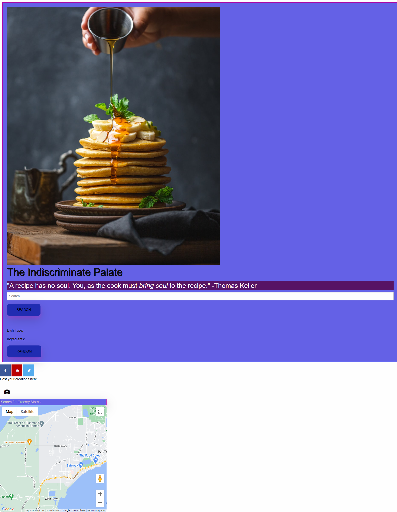
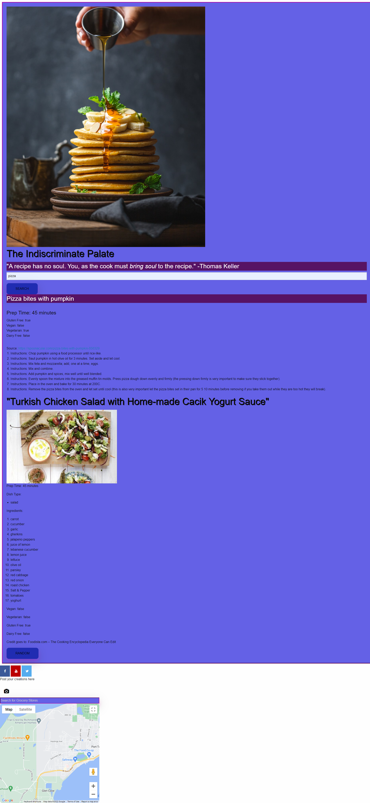

# Team 6 Project - The Indiscriminate Palate

## Collaborators and their GitHub Usernames
Chris Kang - kjman26

Tahlia Bolden - Bloomcaster

Andrea Hergert - andreahergert

Stephen Oun - DevSteph0

## Description

The Indiscriminate Palate is a recipe randomizer for group project 1 for the UW Coding Bootcamp.  This page uses HTML, CSS, Javascript, and Web APIs to create a functioning application.  This application allows users to either search for a random recipe with a keyword or just press the random button to get a completely random recipe.  Users can also use the Google map below to search for their nearest grocery store.

## Installation
Use a web browser to access the site:

https://andreahergert.github.io/team-6-project/

## Technologies Used
Spoonacular API https://spoonacular.com/food-api

Google Places API https://developers.google.com/maps/documentation/places/web-service

## Usage
The user will be presented with the Google Places API asking for their location.  The user can either allow their location to be known and their general area will show up on the Google map at the bottom of the page or the user can reject having their location known and the Google map at the bottom of the page will show a specific location of Seattle.

The user will then be allowed to either search for a random recipe with a keyword in the input box or just press the random button to get a completely random recipe.

## Screenshots of Website

Shows what the application looks like on the initial load:

Shows what the application looks like upon usage:

## License
MIT License